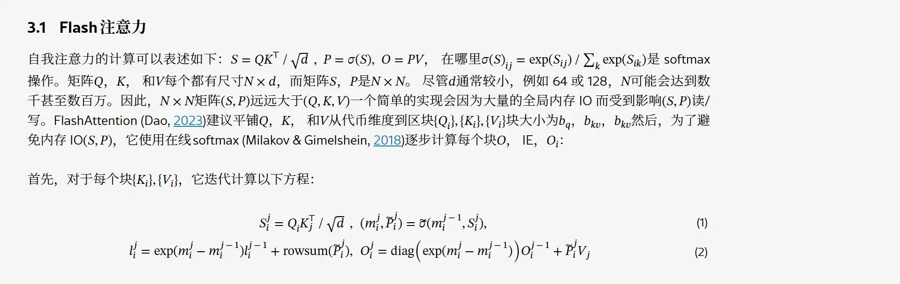

# arxiv翻译修复器！

arxiv前1段时间推出了HTML渲染功能，这样1来看论文的时候就可以用浏览器的右键翻译了，非常方便！

但是美中不足的是，Google翻译会把公式也翻译成中文，结果就会变成奇怪的东西，根本没法看，像是这样——


而且左下角还有「升我经验」！

好在聪明的莉沫酱发明了arxiv翻译修复器，通过阻止公式之类的东西被翻译成中文，就可以修复这个问题！


## 使用效果



这样1来就可以不用在英文和中文页面之间切来切去啦！


## 使用方法

### 简易版

直接把这段代码复制到F12的控制台里，然后再右键翻译就可以了。

```js
for (const i of document.querySelectorAll('math, table, cite')) {
    i.setAttribute('translate', 'no')
}
```

### 持久版

如果你觉得每次都要开F12很麻烦，也可以这样:

- 去Chrome应用商店安装1个[Tampermonkey](https://chrome.google.com/webstore/detail/tampermonkey/dhdgffkkebhmkfjojejmpbldmpobfkfo)
- 在Tampermonkey里点击「添加新脚本」
- 然后把[arxiv-translate-fix.js](./arxiv-translate-fix.js)里面的内容复制到脚本里保存

这样1来，以后你翻译arxiv就都有自动修复的功能啦！


## 结束

就这样，我要回去看pixiv了，大家88！
